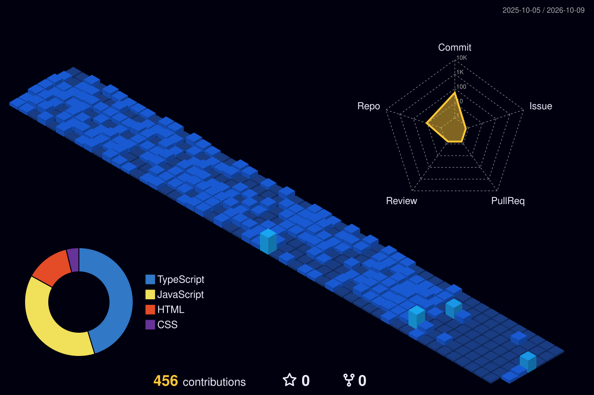

 

 

 

 

## Projects

| Project | What it does | Stack | Links |
| :-- | :-- | :-- | :-- |
| **Ai-SupportBot** | An embeddable SaaS AI Customer Support Bot powered by Google Gemini API for real-time, context-aware assistance. | Next.js, Node.js, Gemini API, Scalekit | [Repo](https://github.com/Raksha074/Ai-SupportBot)   [Live](ai-support-bot-uzyh.vercel.app/) |
| **Savoria** | A full-stack restaurant booking system featuring RBAC (Customer, Owner, Admin) and real-time table management. | React.js, Node.js, Express, MongoDB, JWT | [Repo](https://github.com/Raksha074/Savoria)   [Live](savoria-tau.vercel.app/) |

 

## Contributions

The city above is generated by [yoshi389111/github-profile-3d-contrib](https://github.com/yoshi389111/github-profile-3d-contrib) through `.github/workflows/profile-3d.yml`. It appears after the workflow has run once.

 

## Connect

[GitHub](https://github.com/Raksha074) &nbsp;|&nbsp; [Email](mailto:Rakshanarware2@gmail.com) &nbsp;|&nbsp; [Repositories](https://github.com/Raksha074?tab=repositories)

Bhopal, MP, India

